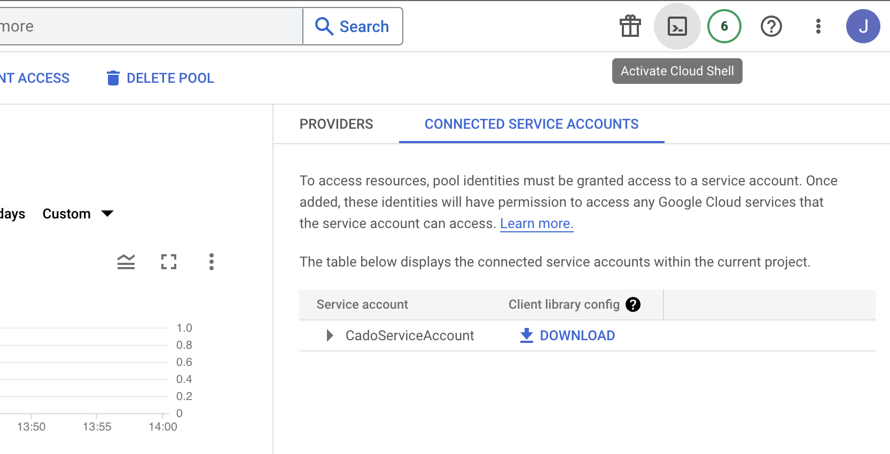
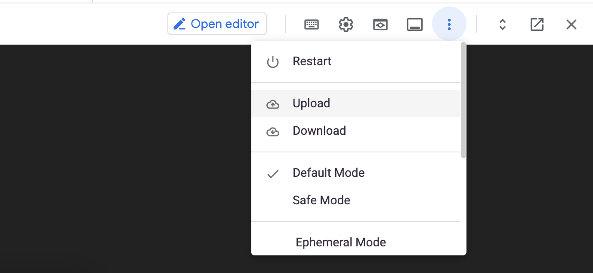

# gcp-setup
Scripts to aid in automating setup of GCP environment to support acquisition by Cado. For more details see the [Cado documentation](https://docs.cadosecurity.com/cado-response/deploy/gcp/gcp-auto-setup). These should be run from inside the GCP Clound Shell in the Primary account. 

Automating GCP setup comprises three scripts

1. **gcp_setup_1_role.sh** - Creates a 'CadoGCPRole' role within the active project with scoped permissions for Cado to operate. If you want to create the role at the organization level for use across multiple projects, add the organization ID as a parameter.
When the script finishes you should see the role ID printed, we will use this role ID in other scripts so it's best to save it somewhere.

   >*Usage*: `bash gcp_setup_1_role.sh`

2. **gcp_setup_2_service_account.sh** - Creates a 'CadoServiceAccount' service account within the active project, using the CadoGCPRole role's permissions. You need to specify the role ID from the previous script as a parameter when executing.

   >*Usage*: `bash gcp_setup_2_service_account.sh <cado_gcp_role_id>`

3. **gcp_setup_3_WIF.sh** - Will create a 'cado-aws-pool' workload identity pool with a 'Cado-AWS-Provider' identity provider and will also connect the previously created 'CadoServiceAccount' service account. This script needs the AWS account ID you will be authenticating with passed as a parameter. Once executing finishes, you can navigate to the 'Connected Service Accounts' tab in the pool and download the credentials ready to use in the platform.

   >*Usage*: `bash gcp_setup_3_WIF.sh <12-digit-aws-acccount-id>`

*Note: Assumes you already have a service account called 'CadoServiceAccount' and will not work if that account is not available*

4. **gcp_setup_cross_project.sh** - is optional and will setup a target project ready for acquisition using the original 'CadoServiceAccount', enabling the CloudBuild API and granting access to the origin project's service accounts. This means you won't need separate credentials to access assets in the target project. This script will only work if the original 'CadoGCPRole' was created at the organization level and will need that role ID along with the target project's ID passed as parameters.

   >*Usage*: `bash gcp_setup_4_cross_project.sh <cado_gcp_role_id> <secondary-project-id>`
   

## Using the scripts in the GCP Cloud Shell

To enable the GCP Shell in the GCP Console click on the Activate Cloud Shell icon

To upload the shell scripts, once the shell is open, upload the scripts using the Upload icon

